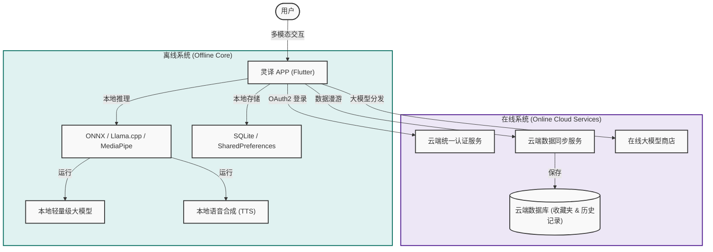

# 灵译 (XJ Translator) - AI即时翻译APP 需求与设计规范

本文档为“灵译”APP的核心需求规格说明书与系统架构设计指南。旨在梳理项目的核心功能矩阵、双系统运行机制及关键技术选型，为后续的功能开发提供精准的技术指引与路线图。

---

## 🗺️ 1. 核心架构与双系统设计

“灵译”采用**“在线云端+离线本地”双核驱动**的混合系统架构。在离线状态下保证核心翻译的可用性，在在线状态下增强云同步、高阶模型分发及用户数据漫游。



---

## 🛠️ 2. 核心功能矩阵规格说明

### 2.1 轻量大模型下载与默认设置
* **大模型下载商店**：APP 内置“模型商店”中心，展示适用于移动端运行的轻量大模型（如 Gemma-2B, Llama-3-8B-4bit, Qwen-1.8B 等）。
* **下载与存储管理**：支持断点续传、后台下载、存储占用预估，并可自动对模型完整性进行校验。
* **默认模型设定**：用户可以在已下载的模型列表中，指定某个模型作为“全局默认翻译/语音推理模型”。

> [!TIP]
> **本地推理优化**：通过 4-bit 甚至 2-bit 权重量化（Quantization），将模型大小压缩到 1.5GB - 3.0GB 以内，使主流手机可在 CPU/NPU 上以可接受的 Token 输出率进行流畅 of 本地离线推理。

---

### 2.2 多模态翻译模式 (即时、文本、语音)
* **文本翻译**：标准文本输入与输出，支持大段落与多轮对话式翻译。
* **语音翻译**：单次短语音录制，自动识别为文本并输出翻译结果。
* **即时翻译（即听即输出 / 实时同传）**：
  * **流式识别与翻译**：麦克风持续采集音频，流式输入（Streaming ASR），大模型流式输出译文（Streaming Translation）。
  * **语音伴随输出**：配备专门的流式语音输出（TTS）模型，实现译文实时朗读，达到近乎同声传译的效果。
  * **高度保活机制**：翻译状态下，应用需申请前台服务（Foreground Service）高度保活，在锁屏、后台退出的情况下依然保持音频采集与大模型运行，其优先级与系统接听电话类似。

> [!IMPORTANT]
> **保活技术点**：Android 端需通过 `Foreground Service` (绑定持久化 notification)，配合 WakeLock 防止 CPU 休眠；iOS 端需激活 `Audio, AirPlay, and Picture in Picture` Background Mode，以保证后台不间断的录音与播放权限。

---

### 2.3 大规模文档/PDF翻译与跨应用分享
* **文档解析与还原**：支持 PDF, Word, Excel, PPT, TXT 等格式的解析。
* **原排版智能保持**：翻译在保持原有文档版式、字体大小、图片位置不变的情况下，替换对应文本块，最终生成同格式翻译后文档。
* **跨应用分发**：支持原生调用 `Share` 面板，一键将生成的文件通过原生 Channel 分享至**微信（WeChat）**、**QQ**等社交应用，供用户进行外部传输和下载。

---

### 2.4 在线/离线双系统与多端同步
* **无缝离线降级**：当检测到无网络连接时，应用自动由云端推理降级为使用本地默认轻量大模型。
* **多端云同步**：
  * **收藏夹云同步**：在线系统用户登录后，其收藏的优秀模型、提示词（Prompts）以及特色配置会自动同步至云端。
  * **多设备漫游**：用户在平板、新手机等其他设备登录同一账号时，可一键读取“收藏列表”，快速从云端重新拉取并下载大模型，无需重新搜索。

---

### 2.5 历史翻译功能与无痕模式 (隐私保护)
* **自动记录机制**：所有用户的翻译文本和语音记录默认进行本地或云端持久化存储，方便随时检索。
* **手动无痕模式 (Incognito Mode)**：
  * 用户可一键开启/关闭无痕开关。
  * **开启无痕模式时**：禁止写入本地数据库，禁止向云端发送数据与同步请求，翻译完毕离开当前会话后，内存数据即刻销毁。

---

### 2.6 动态视觉系统与夜间模式
* **深色/夜间模式 (Dark Mode)**：提供视网膜友好的纯黑深色背景支持，有效降低夜间翻译时的主动强光刺激。
* **动态主色调切换**：支持基于“动态种子色”的主色调定制，应用将根据主色调自动生成匹配的流体卡片、高档渐变和磨砂玻璃物理特效（如 Glassmorphism）。

---

## 📦 3. 技术选型与实现方案建议

为了支持上述高难度的底层功能，建议集成以下 Flutter 社区高质量开源依赖：

| 功能模块 | 推荐 Flutter 插件 | 关键考量 / 作用 |
| :--- | :--- | :--- |
| **本地大模型推理** | `flutter_llama` 或 `mediapipe` | 封装了 C++ 底层的 `llama.cpp`，利用手机 of CPU/NPU 运行 GGUF 格式的轻量大模型。 |
| **前台保活** | `flutter_foreground_task` | 用于 Android 端创建顽固前台服务，绑定 Notification，确保即时翻译高度保活。 |
| **实时录音与播放** | `record` + `audioplayers` | 用于后台音频持续采集（流式 ASR 输入）与翻译结果朗读（TTS 输出）。 |
| **文档解析与生成** | `syncfusion_flutter_pdf` | 极强大的商业级 PDF 解析与编辑工具，支持段落提取与原排版替换。 |
| **跨应用分享** | `share_plus` | 官方标准的多平台分享工具，完美支持向微信、QQ 发送二进制文档。 |
| **本地高速存储** | `isar` 或 `sqflite` | 强类型、高速、轻量的本地数据库，用于存储海量翻译历史与大模型元数据。 |

---

## 🚀 4. 后续开发迭代路线图 (Roadmap)

```
┌──────────────────────────────────────────────┐
│  Phase 1: 界面重塑与基础层 (已完成)          │
│  - 纯净 Dart 重构与 Material 3 规范适配      │
│  - 浅色/深色动态主题与胶囊导航栏实现         │
└──────────────────────┬───────────────────────┘
                       │
                       ▼
┌──────────────────────────────────────────────┐
│  Phase 2: 在线离线双核与模型管理 (当前准备)  │
│  - 模型商店 UI、本地大模型推理引擎选型搭建   │
│  - 引入 Isar 数据库，开发无痕模式/历史记录    │
└──────────────────────┬───────────────────────┘
                       │
                       ▼
┌──────────────────────────────────────────────┐
│  Phase 3: 即时翻译保活与文档解析 (未来突破)  │
│  - 前台服务 (Foreground Service) 保活开发    │
│  - PDF/Word 解析、翻译排版还原与微信分享集成 │
└──────────────────────────────────────────────┘
```

> [!NOTE]
> 本规范已完全归档。未来在新增或扩展项目模块时，应严格遵循本规范中定义的数据存储原则与高度保活的技术选型，确保应用的极致体验与技术规范统一。
